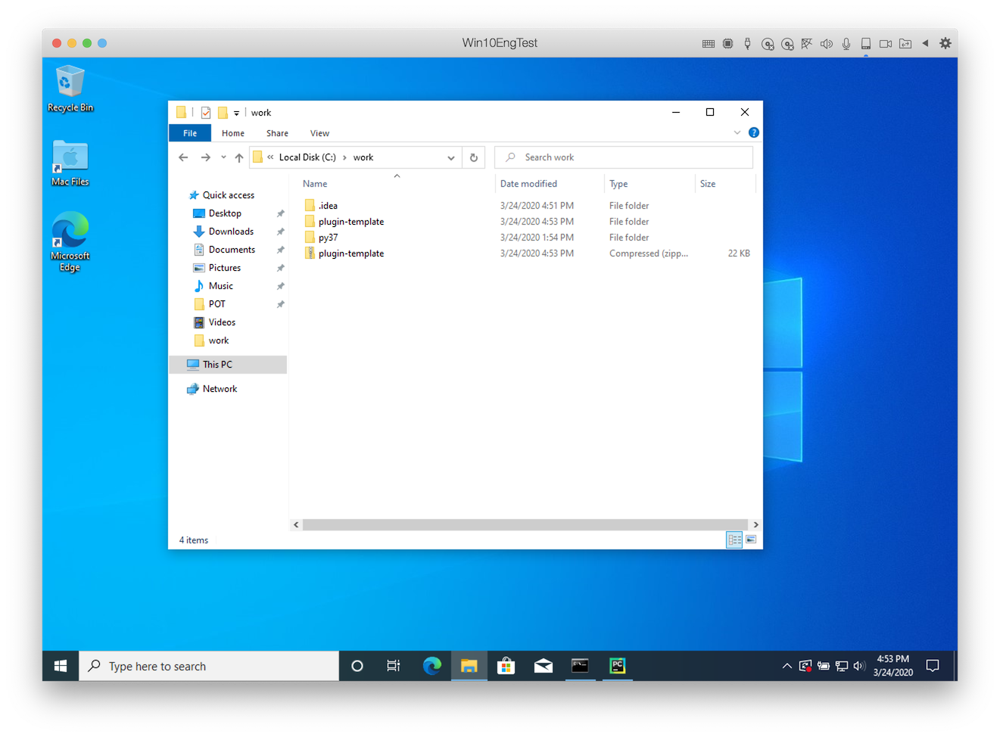

# Download the plugin template

You can download [template zipped file](https://s3-us-west-2.amazonaws.com/rpa-file.argos-labs.com/plugin-template.zip) from our [POT SDK Guide](https://www.argos-labs.com/new-argos-pot-sdk/).

> Saved template filename is `plugin-template.zip`

Please extract the downloaded zip file under `C:\work`. So you will see `C:\work\plugin-template` folder.
