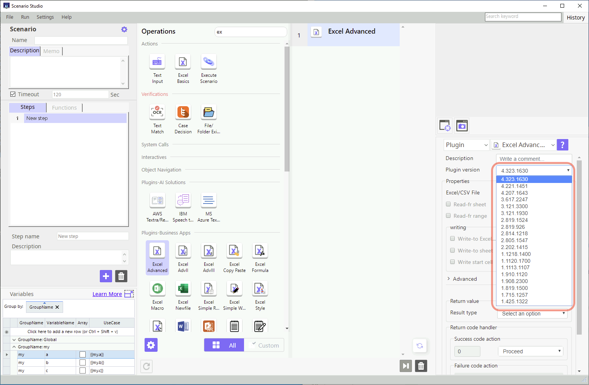

# How to upgrade plugin

There are many reasons to upgrade plugin:
* `Bug`: Mal-functional operation
* `Obsolete dependent module`: Not operation for out of date dependent module
* `Need more function`: Add/Modify input parameters and functions
* and more than tens of hundreds reason to upgrade plugin

Next method is not for the every case but usually we follow next process.

## Find the problem

When some abnomal situation happen Finding the exact problem is the most important thing.

### Reproduce the problem

Most of error reports came from others which use your plugin. 
In this case first thing is to reproduce that problem. 
When you try to reproduce you have to know or gather at least as much as possible:
* OS Release: Windows 10 SP 2 (build xxxxx)
* Main Language: English, Korean, Japnanese, Chinese and so on
* Environmental Variables: %UserProfile%, %Temp%, ...
* ...

## How to solve the problem

Once you find the problem then you can solve the problem.
If you review the code which you made then you can solve easily.
However sometimes you have to maintain the code by others. 
In this case the first thing is that run the `tests\test_me.py` unittest code.
Usually these test cases contains all good and bad functionalities you can see the intention of the original code.

## Coding

You can modity the main `__init__.py` file.

### How to modify original code

Normally you can follow next procedures:
* Debug `test_me.py` test cases
* When you get some case of problem you can debug it
* If you cannot get the problem case then it is important to create the problem case at `test_me.py`
* You can have the breakpoints at source `__init__.py` and find problem at `PyCharm` debug mode
* Loop of Modify code, Debug test case

### How to add a new functionality

If someone request new functionality at this plugin you have to think these things:
* If possible do not change input design so previous running bot have no effects
* Add a new options or parameters for the new functionality 
* Add one or more new test cases at `test_me.py`

## Testing

The test cases at `test_me.py` is really important. Sometime we can say more important than code.
When test all cases regression testing is play the role.
Let's suppose that you have the 100 funcationalities and have 100 test cases. This plugin is working well during one year.
Now you just added a new functionality at your code and one more test case.
You are testing the 101 test cases. If the tests passed then it is lucky.
Usually even the new added case is passed some of the rest cases would not be passed by side effects.
We call this `regression testing`.
So let's create test cases not just success but also failure.

## Config `setup.yaml`

You have to do `version up` at `setup.yaml` file.

## Building

Building process is the same with the command `build.bat`.

## Testing the bot

If you have reproduced failure bot case you have to test that bot is working well after upgrade.

Once you update your plugin you can see the versions at STU like above image. You can upgrade target version and `test run` the bot.
