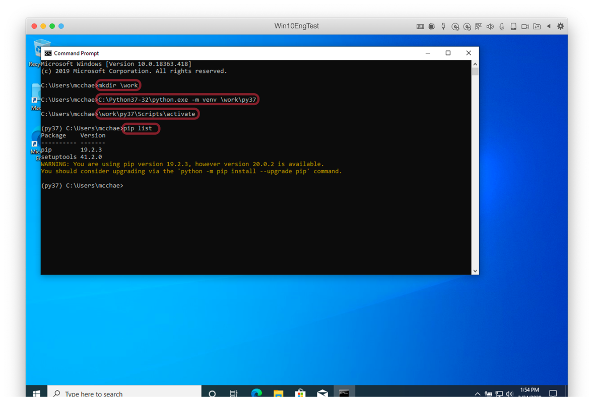
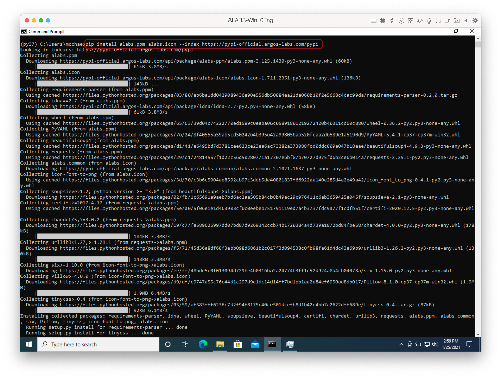
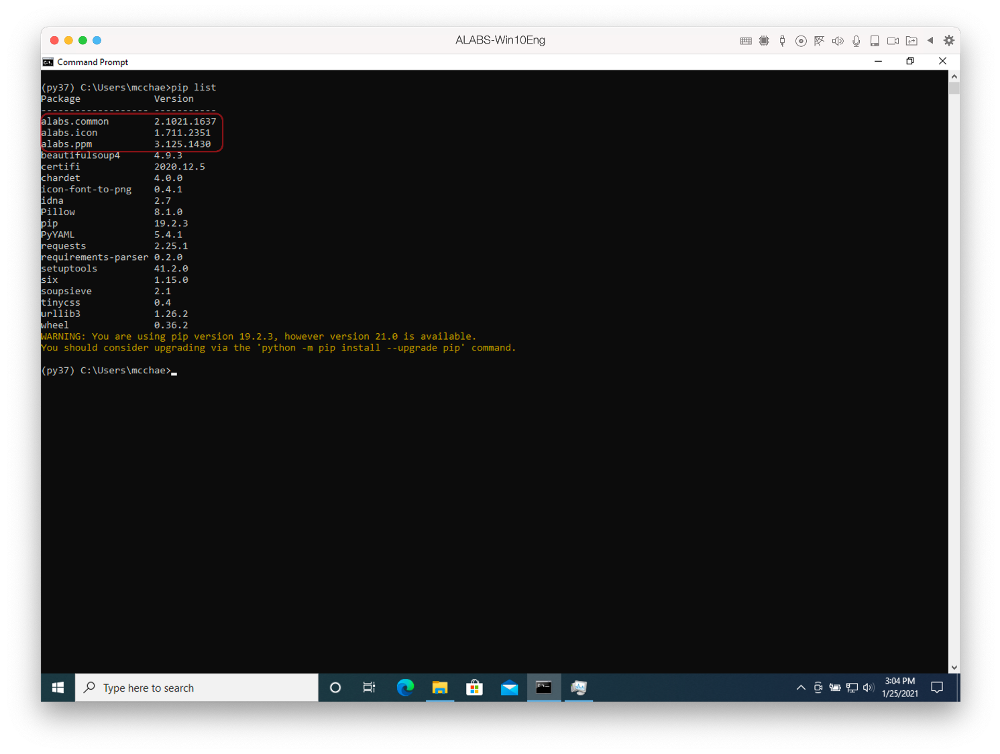

# Install POT SDK

Once you prepare python 3.7 virtuenenv environment, [Preparation of Python Interpreter](https://github.com/Jerry-Chae/pot-sdk-doc/blob/main/Preparation-of-Python-3.7.md) it is time to install POT `Python-to-Operations Tools` SDK.


## Install POT SDK on Windows 10

### VirtualEnv

Before we start we need to enter into pythhon `virtualenv`.



``` sh
C:\> C:\work\py37\Scripts\activate
(py37) C:\>
```

> * `py37` virtualenv is prepared at `C:\work\py37`

If you list python modules with pip command for the new created python `virtualenv` the result as follows:

``` sh
(py37) C:\> pip list
Package    Version
---------- -------
pip        20.1.1
setuptools 47.1.0
WARNING: You are using pip version 20.1.1; however, version 21.1.3 is available.
You should consider upgrading via the 'c:\work\py37\scripts\python.exe -m pip install --upgrade pip' command.
```

> * `pip` and `setuptools` is the default python modules
> * The WARNING says your `pip` version is not up to date. You may upgrade it but not mandotory.
> * Exact version may not the same as above.

### Installation

There are three POT SDK library and tools:

* alabs.common : a library which can support POT SDK
* alabs.ppm : the main tool for POT SDK
* alabs.icon : a icon tool for plugin


You can install POT SDK with one line command:

`pip install -U alabs.common alabs.ppm alabs.icon -i https://pypi-official.argos-labs.com/simple`

> * `-U` option is optional which means upgrade if there is newer version

``` sh
(py37) C:\> pip install -U alabs.common alabs.ppm alabs.icon -i https://pypi-official.argos-labs.com/simple
Looking in indexes: https://pypi-official.argos-labs.com/simple
Collecting alabs.ppm
  Downloading https://pypi-official.argos-labs.com/api/package/alabs-ppm/alabs.ppm-3.709.1600-py3-none-any.whl (65 kB)
     |████████████████████████████████| 65 kB ...
Collecting alabs.icon
  Downloading https://pypi-official.argos-labs.com/api/package/alabs-icon/alabs.icon-1.711.2351-py3-none-any.whl (136 kB)
     |████████████████████████████████| 136 kB 6.8 MB/s

...

Successfully installed Pillow-8.3.1 PyInstaller-4.4 PyYAML-5.4.1 alabs.common-3.709.1600 
alabs.icon-1.711.2351 alabs.ppm-3.709.1600 altgraph-0.17 beautifulsoup4-4.9.3 certifi-2021.5.30 charset-normalizer-2.0.2 
future-0.18.2 icon-font-to-png-0.4.1 idna-2.7 importlib-metadata-4.6.1 packaging-21.0 pefile-2021.5.24 pyinstaller-hooks-contrib-2021.2 
pyparsing-2.4.7 pywin32-ctypes-0.2.0 requests-2.26.0 requirements-parser-0.2.0 six-1.16.0 soupsieve-2.2.1 tinycss-0.4 
typing-extensions-3.10.0.0 urllib3-1.26.6 wheel-0.36.2 zipp-3.5.0
```



### Verification

You can list all installed modules by `pip list` command.

```sh
(py37) C:\>pip list
Package                   Version
------------------------- ----------
alabs.common              3.709.1600
alabs.icon                1.711.2351
alabs.ppm                 3.709.1600
altgraph                  0.17
beautifulsoup4            4.9.3
certifi                   2021.5.30
charset-normalizer        2.0.2
future                    0.18.2
icon-font-to-png          0.4.1
idna                      2.7
importlib-metadata        4.6.1
packaging                 21.0
pefile                    2021.5.24
Pillow                    8.3.1
pip                       21.1.3
pyinstaller               4.4
pyinstaller-hooks-contrib 2021.2
pyparsing                 2.4.7
pywin32-ctypes            0.2.0
PyYAML                    5.4.1
requests                  2.26.0
requirements-parser       0.2.0
setuptools                47.1.0
six                       1.16.0
soupsieve                 2.2.1
tinycss                   0.4
typing-extensions         3.10.0.0
urllib3                   1.26.6
wheel                     0.36.2
zipp                      3.5.0
```

First three modules is for POT SDK,

* alabs.common              3.709.1600
* alabs.icon                1.711.2351
* alabs.ppm                 3.709.1600

And the rest modules are dependent python modules from [pypi.org](https://pypi.org/)

> * Versions may be upgraded after this documentation.



Now that POT SDK is installed your system you can start plugin building.


## Install POT SDK on Linux (Ubuntu Desktop)

### VirtualEnv

Before we start we need to enter into pythhon `virtualenv`.

```sh
toor@ubuntu:~$ pyenv activate py37
pyenv-virtualenv: prompt changing will be removed from future release. configure `export PYENV_VIRTUALENV_DISABLE_PROMPT=1' to simulate the behavior.
(py37) toor@ubuntu:~$
```

> * User name is `toor` as example environment so $HOME folder is `/home/toor`

If you list python modules with pip command for the new created python `virtualenv` the result as follows:

```sh
(py37) toor@ubuntu:~$ pip list
Package    Version
---------- -------
pip        19.2.3 
setuptools 41.2.0 
WARNING: You are using pip version 19.2.3, however version 21.1.3 is available.
You should consider upgrading via the 'pip install --upgrade pip' command.
```

> * `pip` and `setuptools` is the default python modules
> * The WARNING says your `pip` version is not up to date. You may upgrade it but not mandotory.
> * Exact version may not the same as above.

### Installation

There are three POT SDK library and tools:

* alabs.common : a library which can support POT SDK
* alabs.ppm : the main tool for POT SDK
* alabs.icon : a icon tool for plugin


You can install POT SDK with one line command:

`pip install -U alabs.common alabs.ppm alabs.icon -i https://pypi-official.argos-labs.com/simple`

> * `-U` option is optional which means upgrade if there is newer version

``` sh
(py37) toor@ubuntu:~$ pip install -U alabs.common alabs.ppm alabs.icon -i https://pypi-official.argos-labs.com/simple
Looking in indexes: https://pypi-official.argos-labs.com/simple
Collecting alabs.ppm
  Downloading https://pypi-official.argos-labs.com/api/package/alabs-ppm/alabs.ppm-3.709.1600-py3-none-any.whl (65 kB)
     |████████████████████████████████| 65 kB ...
Collecting alabs.icon
  Downloading https://pypi-official.argos-labs.com/api/package/alabs-icon/alabs.icon-1.711.2351-py3-none-any.whl (136 kB)
     |████████████████████████████████| 136 kB 6.8 MB/s

...

Successfully installed Pillow-8.3.1 PyInstaller-4.4 PyYAML-5.4.1 alabs.common-3.709.1600 
alabs.icon-1.711.2351 alabs.ppm-3.709.1600 altgraph-0.17 beautifulsoup4-4.9.3 certifi-2021.5.30 charset-normalizer-2.0.2 
future-0.18.2 icon-font-to-png-0.4.1 idna-2.7 importlib-metadata-4.6.1 packaging-21.0 pefile-2021.5.24 pyinstaller-hooks-contrib-2021.2 
pyparsing-2.4.7 pywin32-ctypes-0.2.0 requests-2.26.0 requirements-parser-0.2.0 six-1.16.0 soupsieve-2.2.1 tinycss-0.4 
typing-extensions-3.10.0.0 urllib3-1.26.6 wheel-0.36.2 zipp-3.5.0
```

### Verification

You can list all installed modules by `pip list` command.

```sh
(py37) toor@ubuntu:~$ pip list
Package                   Version
------------------------- ----------
alabs.common              3.709.1600
alabs.icon                1.711.2351
alabs.ppm                 3.709.1600
altgraph                  0.17
beautifulsoup4            4.9.3
certifi                   2021.5.30
charset-normalizer        2.0.2
icon-font-to-png          0.4.1
idna                      2.7
importlib-metadata        4.6.1
packaging                 21.0
Pillow                    8.3.1
pip                       21.1.3
pyinstaller               4.4
pyinstaller-hooks-contrib 2021.2
pyparsing                 2.4.7
PyYAML                    5.4.1
requests                  2.26.0
requirements-parser       0.2.0
setuptools                41.2.0
six                       1.16.0
soupsieve                 2.2.1
tinycss                   0.4
typing-extensions         3.10.0.0
urllib3                   1.26.6
wheel                     0.36.2
zipp                      3.5.0
```

First three modules is for POT SDK,

* alabs.common              3.709.1600
* alabs.icon                1.711.2351
* alabs.ppm                 3.709.1600

And the rest modules are dependent python modules from [pypi.org](https://pypi.org/)

> * Versions may be upgraded after this documentation.

Now that POT SDK is installed your system you can start plugin building.


## Install POT SDK on macOS (Big Sur)

### VirtualEnv

Before we start we need to enter into pythhon `virtualenv`.

```sh
toor@mac: ~|⇒ pyenv deactivate
toor@mac: ~|⇒ pyenv versions
  system
* 3.7.11 (set by /Users/mcchae/.pyenv/version)
  3.7.11/envs/py37
  py37
```

> * User name is `toor` as example environment so $HOME folder is `/Users/toor`

If you list python modules with pip command for the new created python `virtualenv` the result as follows:

```sh
toor@mac: ~|⇒ pip list
Package    Version
---------- -------
pip        20.1.1
setuptools 47.1.0
WARNING: You are using pip version 20.1.1; however, version 21.1.3 is available.
You should consider upgrading via the '/Users/toor/.pyenv/versions/3.7.11/envs/py37/bin/python3.7 -m pip install --upgrade pip' command.
```

> * `pip` and `setuptools` is the default python modules
> * The WARNING says your `pip` version is not up to date. You may upgrade it but not mandotory.
> * Exact version may not the same as above.

### Installation

There are three POT SDK library and tools:

* alabs.common : a library which can support POT SDK
* alabs.ppm : the main tool for POT SDK
* alabs.icon : a icon tool for plugin


You can install POT SDK with one line command:

`pip install -U alabs.common alabs.ppm alabs.icon -i https://pypi-official.argos-labs.com/simple`

> * `-U` option is optional which means upgrade if there is newer version

``` sh
toor@mac: ~|⇒ pip install -U alabs.common alabs.ppm alabs.icon -i https://pypi-official.argos-labs.com/simple
Looking in indexes: https://pypi-official.argos-labs.com/simple
Collecting alabs.ppm
  Downloading https://pypi-official.argos-labs.com/api/package/alabs-ppm/alabs.ppm-3.709.1600-py3-none-any.whl (65 kB)
     |████████████████████████████████| 65 kB ...
Collecting alabs.icon
  Downloading https://pypi-official.argos-labs.com/api/package/alabs-icon/alabs.icon-1.711.2351-py3-none-any.whl (136 kB)
     |████████████████████████████████| 136 kB 6.8 MB/s

...

Successfully installed Pillow-8.3.1 PyInstaller-4.4 PyYAML-5.4.1 alabs.common-3.709.1600 
alabs.icon-1.711.2351 alabs.ppm-3.709.1600 altgraph-0.17 beautifulsoup4-4.9.3 certifi-2021.5.30 charset-normalizer-2.0.2 
future-0.18.2 icon-font-to-png-0.4.1 idna-2.7 importlib-metadata-4.6.1 packaging-21.0 pefile-2021.5.24 pyinstaller-hooks-contrib-2021.2 
pyparsing-2.4.7 pywin32-ctypes-0.2.0 requests-2.26.0 requirements-parser-0.2.0 six-1.16.0 soupsieve-2.2.1 tinycss-0.4 
typing-extensions-3.10.0.0 urllib3-1.26.6 wheel-0.36.2 zipp-3.5.0
```

### Verification

You can list all installed modules by `pip list` command.

```sh
toor@mac: ~|⇒ pip list
Package                   Version
------------------------- ----------
alabs.common              3.709.1600
alabs.icon                1.711.2351
alabs.ppm                 3.709.1600
altgraph                  0.17
beautifulsoup4            4.9.3
certifi                   2021.5.30
charset-normalizer        2.0.2
icon-font-to-png          0.4.1
idna                      2.7
importlib-metadata        4.6.1
macholib                  1.14
packaging                 21.0
Pillow                    8.3.1
pip                       21.1.3
pyinstaller               4.4
pyinstaller-hooks-contrib 2021.2
pyparsing                 2.4.7
PyYAML                    5.4.1
requests                  2.26.0
requirements-parser       0.2.0
setuptools                47.1.0
six                       1.16.0
soupsieve                 2.2.1
tinycss                   0.4
typing-extensions         3.10.0.0
urllib3                   1.26.6
wheel                     0.36.2
zipp                      3.5.0
```

First three modules is for POT SDK,

* alabs.common              3.709.1600
* alabs.icon                1.711.2351
* alabs.ppm                 3.709.1600

And the rest modules are dependent python modules from [pypi.org](https://pypi.org/)

> * Versions may be upgraded after this documentation.

Now that POT SDK is installed your system you can start plugin building.