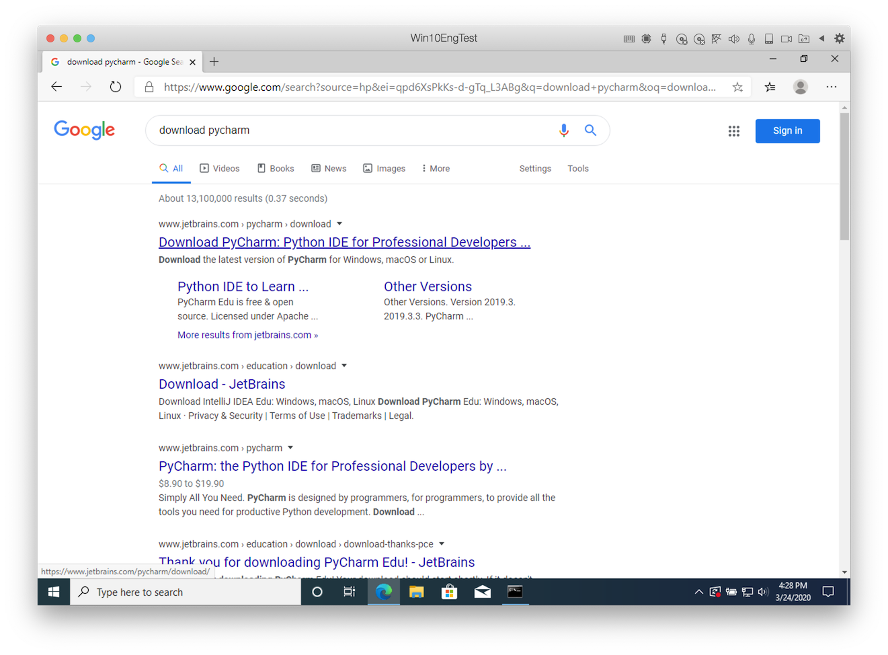
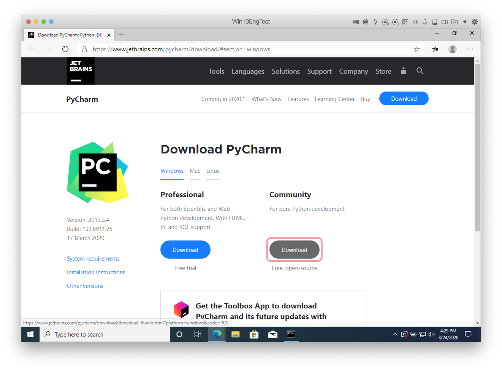
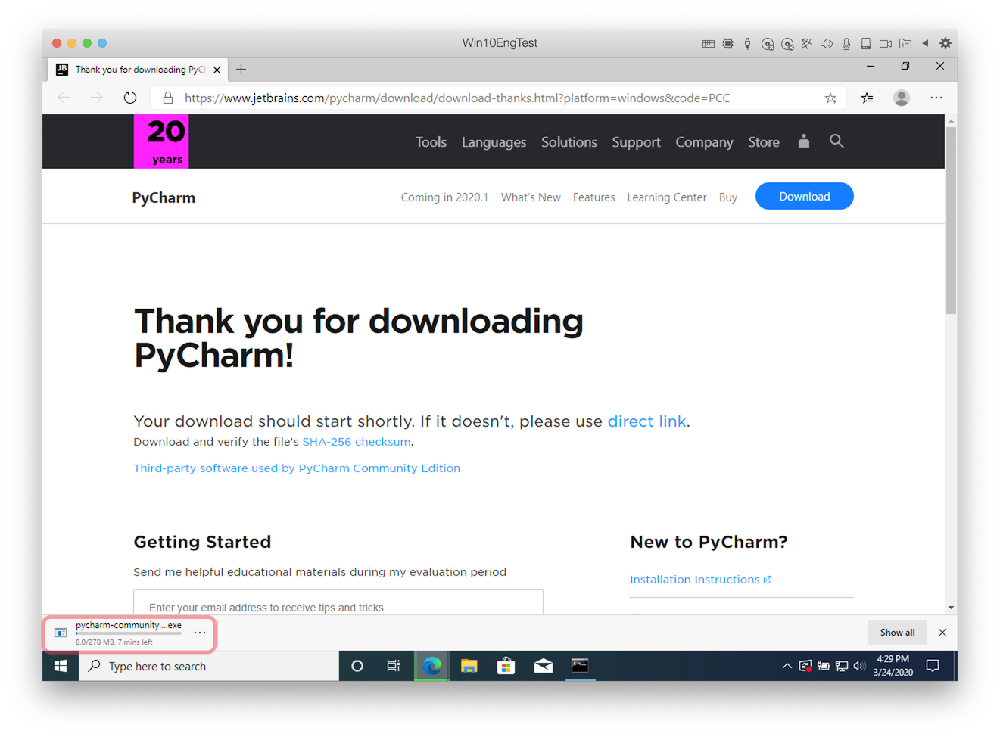
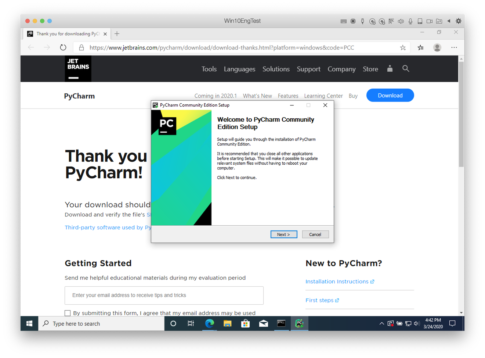
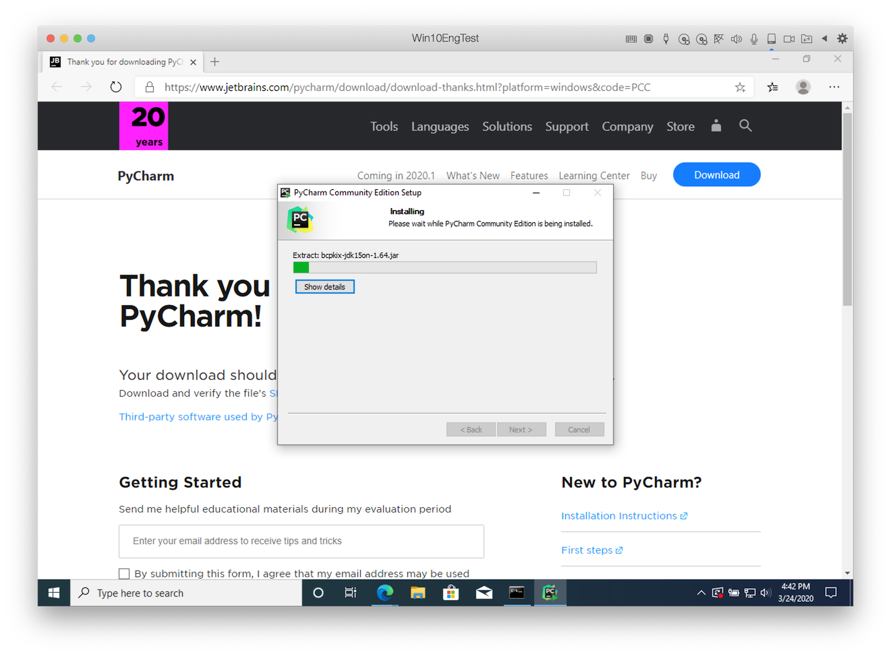
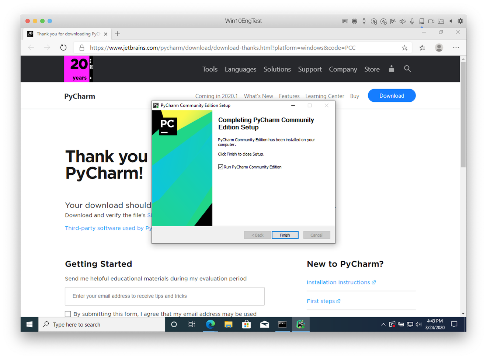
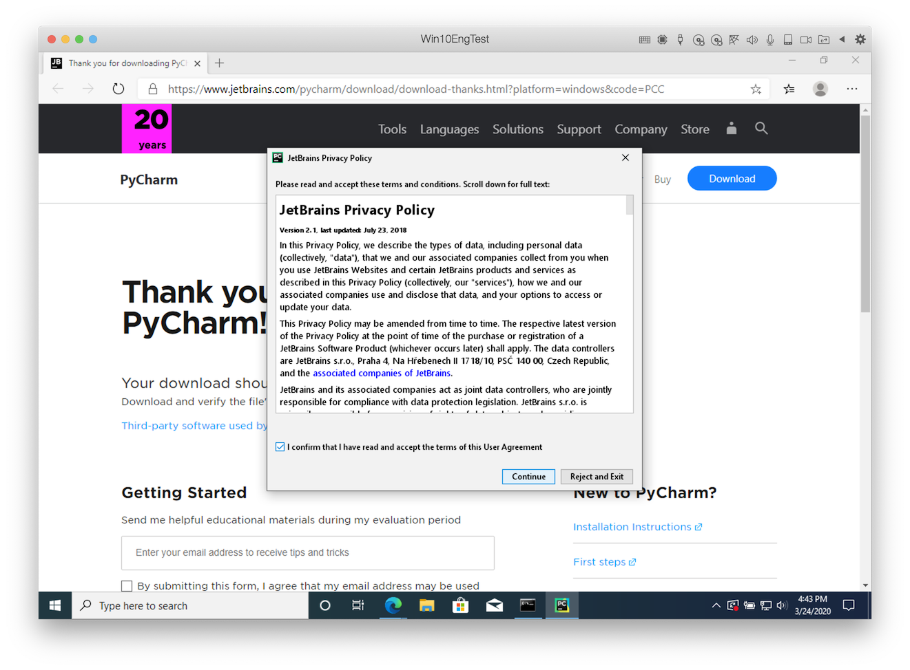
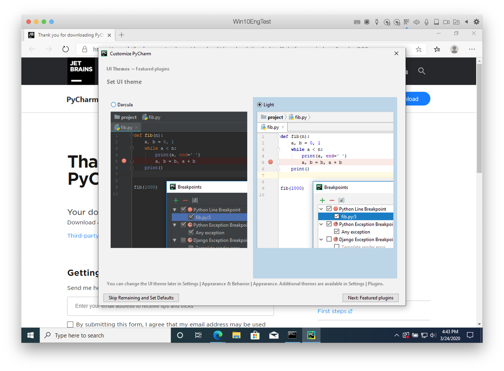
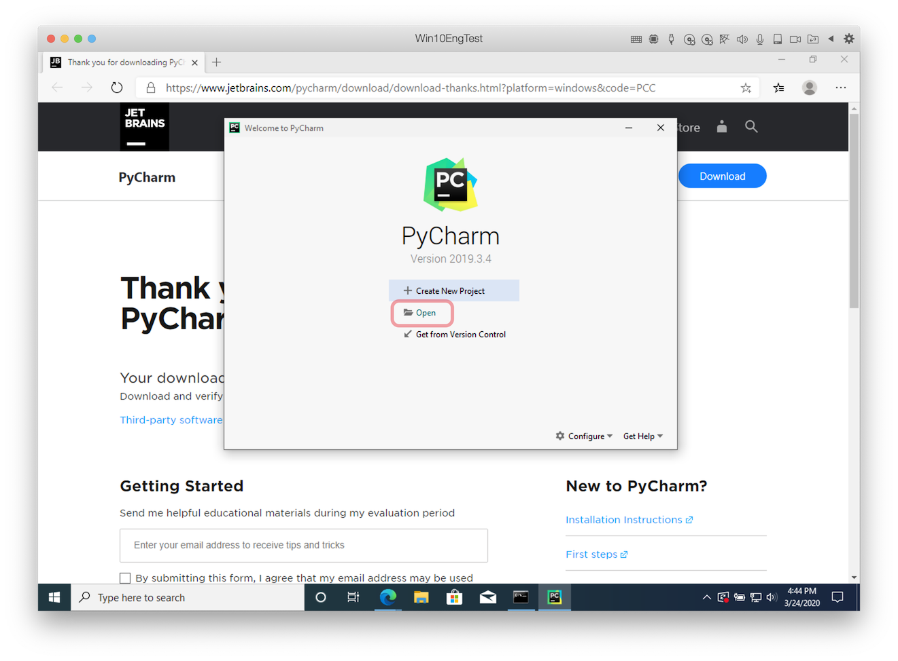
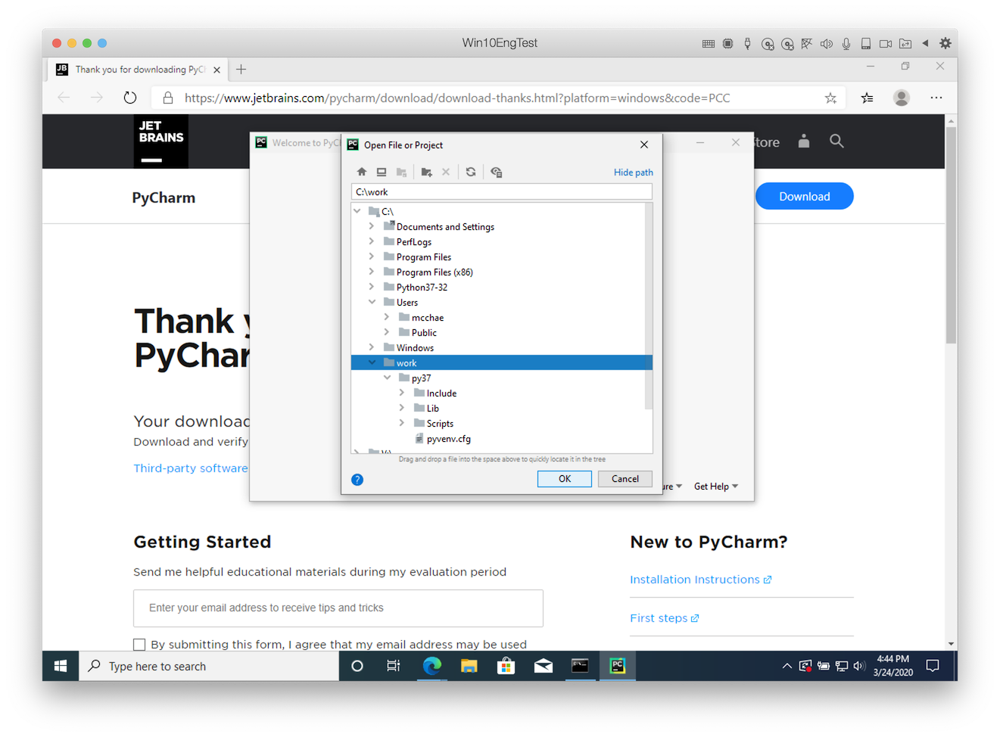

# Installation of PyCharm IDE

[PyCharm](https://en.wikipedia.org/wiki/PyCharm) is an integrated development environment (IDE) used in computer programming, specifically for the Python programming language. It is developed by the Czech company JetBrains (formerly known as IntelliJ).[5] It provides code analysis, a graphical debugger, an integrated unit tester, integration with version control systems (VCSes), and supports web development with Django as well as data science with Anaconda.

Next process shows how to install PyCharm.

## Search PyCharm download page

You can search `download pycharm` at Google and click the first result.

## Download Setup file

You can download PyCharm `Community` edition.

> * PyCharm `Community` edition is free but not `Professional` edition.
> * It's enough to use `Community` edition for building ARGOS plugin.

You can start setup file to install PyCharm.

## Install PyCharm

Click `Next` to start setup.

It takes a few seconds to run this widzerd.

> If some options show up just install with default options.

When finishing `Run PyCharm Community Edition` flag is checked then runs PyCharm.

Please confirm the `JetBrains Privacy Policy`, and then click `Continue`.

Set `UI theme` as you wish.

You can `Create New Project`, but for simple example `Open` folder.

We already created a virtual environment at `C:\work\py37` and install `POT SDK`. We can use open `C:\work`.

> You can change the working folder instead of `C:\work` however change the folder path in this example.

