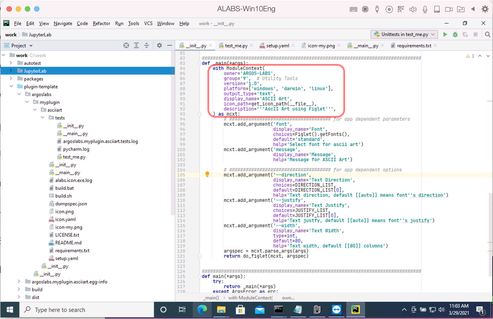
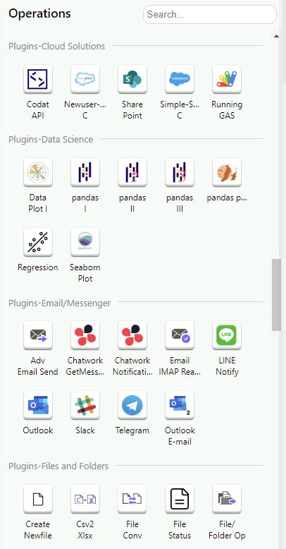
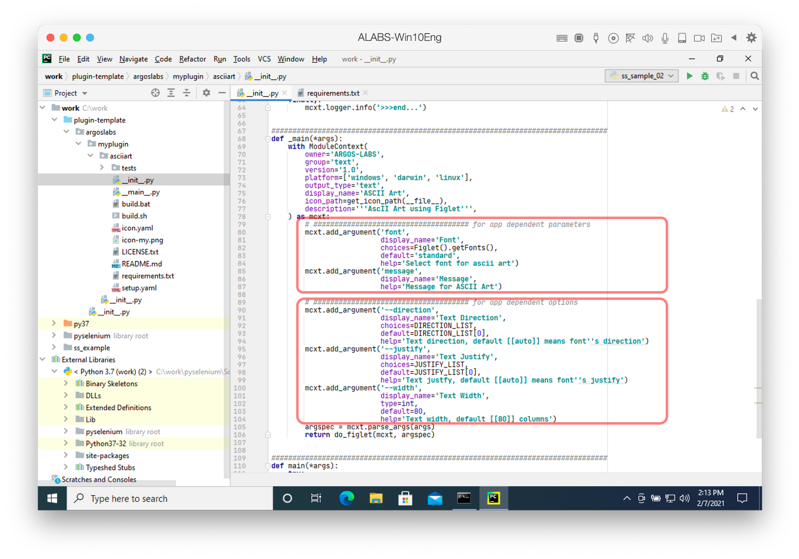
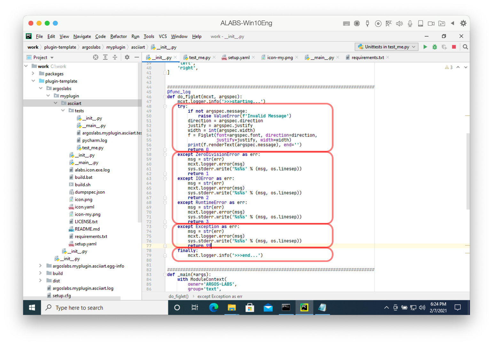
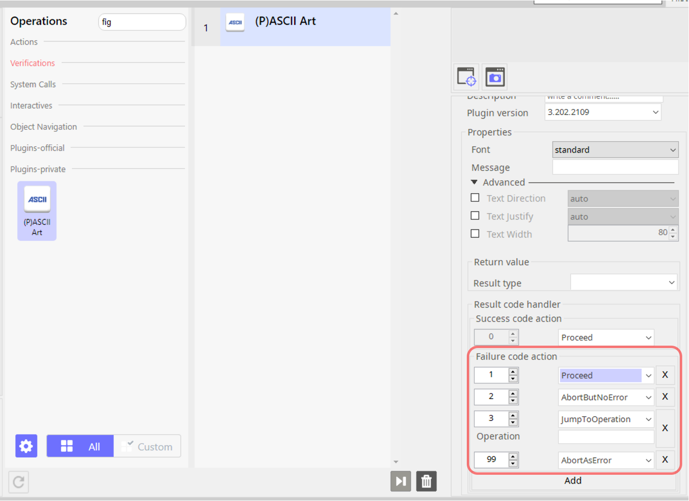
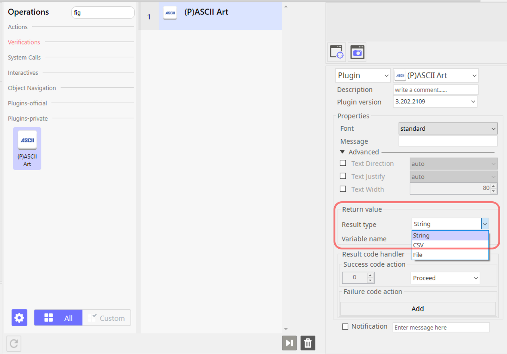
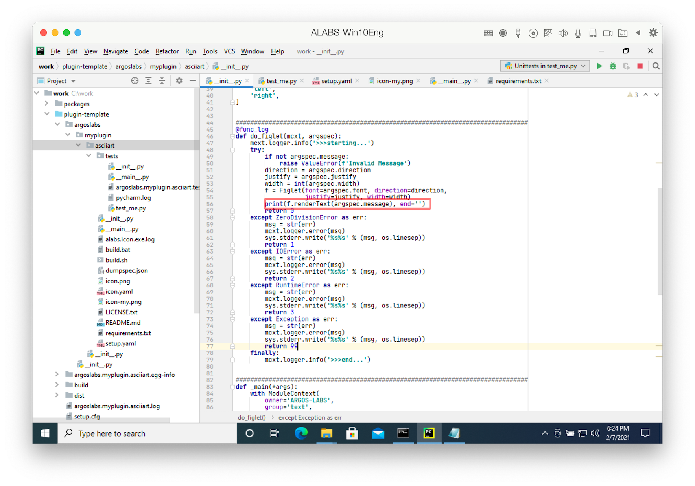

# Main Coding at `__init__.py`

Plugin's main code exists at the source, `argoslabs/myplugin/asciiart/__init__.py`.

## Main python code

Here is the full source:

```python
"""
====================================
 :mod:`argoslabs.myplugin.figlet`
====================================
.. moduleauthor:: Your Name <email@yours>
.. note:: ARGOS-LABS License

Description
===========
ARGOS LABS plugin module for ASCII Art using pyfiglet
"""
# Authors
# ===========
#
# * Your Name
#
# Change Log
# --------
#
#  * [2022/04/12]
#     - Changed for what
#  * [2022/02/02]
#     - starting

################################################################################
import os
import sys
from alabs.common.util.vvargs import ModuleContext, func_log, \
    ArgsError, ArgsExit, get_icon_path
from pyfiglet import Figlet


################################################################################
DIRECTION_LIST = [
    'auto',
    'left-to-right',
    'right-to-left',
]
JUSTIFY_LIST = [
    'auto',
    'left',
    'right',
]


################################################################################
@func_log
def do_figlet(mcxt, argspec):
    mcxt.logger.info('>>>starting...')
    try:
        if not argspec.message:
            raise ValueError(f'Invalid Message')
        direction = argspec.direction
        justify = argspec.justify
        width = int(argspec.width)
        f = Figlet(font=argspec.font, direction=direction,
                   justify=justify, width=width)
        print(f.renderText(argspec.message), end='')
        return 0
    except ValueError as err:
        msg = str(err)
        mcxt.logger.error(msg)
        sys.stderr.write('%s%s' % (msg, os.linesep))
        return 1
    except Exception as err:
        msg = str(err)
        mcxt.logger.error(msg)
        sys.stderr.write('%s%s' % (msg, os.linesep))
        return 99
    finally:
        mcxt.logger.info('>>>end...')


################################################################################
def _main(*args):
    with ModuleContext(
        owner='ARGOS-LABS',
        group='9',  # Utility Tools
        version='1.0',
        platform=['windows', 'darwin', 'linux'],
        output_type='text',
        display_name='ASCII Art',
        icon_path=get_icon_path(__file__),
        description='''AscII Art using Figlet''',
    ) as mcxt:
        # ##################################### for app dependent parameters
        mcxt.add_argument('font',
                          display_name='Font',
                          choices=Figlet().getFonts(),
                          default='standard',
                          help='Select font for ascii art')
        mcxt.add_argument('message',
                          display_name='Message',
                          help='Message for ASCII Art')

        # ##################################### for app dependent options
        mcxt.add_argument('--direction',
                          display_name='Text Direction',
                          choices=DIRECTION_LIST,
                          default=DIRECTION_LIST[0],
                          help='Text direction, default [[auto]] means font''s direction')
        mcxt.add_argument('--justify',
                          display_name='Text Justify',
                          choices=JUSTIFY_LIST,
                          default=JUSTIFY_LIST[0],
                          help='Text justfy, default [[auto]] means font''s justify')
        mcxt.add_argument('--width',
                          display_name='Text Width',
                          type=int,
                          default=80,
                          help='Text width, default [[80]] columns')
        argspec = mcxt.parse_args(args)
        return do_figlet(mcxt, argspec)


################################################################################
def main(*args):
    try:
        return _main(*args)
    except ArgsError as err:
        sys.stderr.write('Error: %s\nPlease -h to print help\n' % str(err))
        return 98
    except ArgsExit as _:
        return 0

```

## ModuleContext at _main function



Every plugin has the function named `main` and `_main`. At the `_main` you can find `ModuleContext` with construction statement.

``` python
    with ModuleContext(
        owner='ARGOS-LABS',
        group='9',  # Utility Tools
        version='1.0',
        platform=['windows', 'darwin', 'linux'],
        output_type='text',
        display_name='ASCII Art',
        icon_path=get_icon_path(__file__),
        description='''AscII Art using Figlet''',
    ) as mcxt:
```
This `ModuleContext` define plugin's main attributes as follows:
* `owner` : You can describe who madke this plugin. `ARGOS-LABS` means our own plugin.
* `group` : This group is for grouping at STU Operation group. The value will be explained below.
* `version` : This version is reserved. Currently not used. Actual version is defined at `setup.yaml` file.
* `platform` : This platform means in what OS platform can be run. You can decide one, two or three platforms as list. Order is not important. There are three platform:
  * `windows` : Windows OS platform
  * `darwin` : Mac OS platform
  * `linux` : Linux OS platform
* `output_type` : This attribute is reserved as `text` and others for the future use.
* `display_name` : This attribue is the name of showed at STU icon text. This name must be unique, we can explain about this later build chapter. You can search any matching words from STU operation pane.
* `icon_path` : Fix with the value of `get_icon_path(__file__)`
* `description` : This attribute is the description of this plugin.

> * This `ModuleContext` class is defined at `alabs.common` library.
> * This `ModuleContext` class is enherited from `ArgumentParser` from [argparse](https://docs.python.org/3.7/library/argparse.html) Python Standard Library. This is because our plugin idea started from that [CLI](https://en.wikipedia.org/wiki/Command-line_interface) parameters can be regarded as corresponding user input interface. Let us explain more detail at `input design`.

Next table is for the value of `group`:
Value | Category
:---:|---
1 | AI Solutions
2 | Business Apps
3 | Cloud Solutions
4 | Data Science
5 | Email/Messenger
6 | Files and Folders
7 | Interactive
8 | Storage Solutions
9 | Utility Tools
10 | Web Scraping
Other Values | Misc

> Any suggestions are welcome if you cannot find proper category.


You can see grouped plugin category at STU.

## Input design with parameters



Next is for `Input design` python code:
```python
        # ##################################### for app dependent parameters
        mcxt.add_argument('font',
                          display_name='Font',
                          choices=Figlet().getFonts(),
                          default='standard',
                          help='Select font for ascii art')
        mcxt.add_argument('message',
                          display_name='Message',
                          help='Message for ASCII Art')

        # ##################################### for app dependent options
        mcxt.add_argument('--direction',
                          display_name='Text Direction',
                          choices=DIRECTION_LIST,
                          default=DIRECTION_LIST[0],
                          help='Text direction, default [[auto]] means font''s direction')
        mcxt.add_argument('--justify',
                          display_name='Text Justify',
                          choices=JUSTIFY_LIST,
                          default=JUSTIFY_LIST[0],
                          help='Text justfy, default [[auto]] means font''s justify')
        mcxt.add_argument('--width',
                          display_name='Text Width',
                          type=int,
                          default=80,
                          help='Text width, default [[80]] columns')
        argspec = mcxt.parse_args(args)
```

Our plugin idea started from that [CLI](https://en.wikipedia.org/wiki/Command-line_interface) parameters can be regarded as corresponding user input interface. Every command has the following structure. Refer [Arguments](https://en.wikipedia.org/wiki/Command-line_interface#Arguments).

Command | Optional Parameters | Positional Parameters | Descriptions
:---:|---|---|---
`ls` | `-a -l` or `-al` | `a.py b.*` | list `a.py` or all files starts with `b.` with `-l` long format and all `-a` format option 
`find` | `-type f` `-name "*.py"` | `/tmp` | find all folder,  file from `/tmp` which have `-type f` the normal file type and `-name "*.py"` have `py` file extension

> * `Optional Parameters` can be omitted as literally
> * `Optional Parameters` can be positioned after `Positional Parameters`
> * `Optional Parameters` starts with `-` charecter. Usually form of `-a` or `--all`. Starting one `-` and following one alphabet character or starting two `--` and following word
> * On Windows `CMD.EXE`, `Optional Parameters` looks like `/h`, `/?` called switch.

`mcxt.add_argument()` function is based on [argparse](https://docs.python.org/3.7/library/argparse.html)'s [ArgumentParser.add_argument()](https://docs.python.org/3.7/library/argparse.html#argparse.ArgumentParser.add_argument). The arguments are as follows:

***ArgumentParser.add_argument***(`name or flags`...[, `action`][, `nargs`][, `const`][, `default`][, `type`][, `choices`][, `required`][, `help`][, `metavar`][, `dest`])

* [name or flags](https://docs.python.org/3.7/library/argparse.html#name-or-flags) - Either a name or a list of option strings, e.g. foo or `-f`, `--foo`.
* [action](https://docs.python.org/3.7/library/argparse.html#action) - The basic type of action to be taken when this argument is encountered at the command line.
* [nargs](https://docs.python.org/3.7/library/argparse.html#nargs) - The number of command-line arguments that should be consumed.
* [const](https://docs.python.org/3.7/library/argparse.html#const) - A constant value required by some action and nargs selections.
* [default](https://docs.python.org/3.7/library/argparse.html#default) - The value produced if the argument is absent from the command line.
* [type](https://docs.python.org/3.7/library/argparse.html#type) - The type to which the command-line argument should be converted.
* [choices](https://docs.python.org/3.7/library/argparse.html#choices) - A container of the allowable values for the argument.
* [required](https://docs.python.org/3.7/library/argparse.html#required) - Whether or not the command-line option may be omitted (optionals only).
* [help](https://docs.python.org/3.7/library/argparse.html#help) - A brief description of what the argument does. If the contents has `[[default]]` string at help string then STU automatically shows `default` at value window. 
* [metavar](https://docs.python.org/3.7/library/argparse.html#metavar) - A name for the argument in usage messages.
* [dest](https://docs.python.org/3.7/library/argparse.html#dest) - The name of the attribute to be added to the object returned by parse_args().

Additionally next arguments are added at ***ModuleContext.add_argument***():

* `display_name` - String display label at STU's property. If omitted this value is same as above `name or flags`
* `show_default` - Usually optional parameter, starts with `-` is in the `Advanced` property and hidden. Even optional parameter if this flag is set `True` then shows above `Advanced` section.
* `input_method` - If this value has the one of these then STU will take proper action to get input value from user:
  * `password` - Shows hidden string with `*` character
  * `fileread` - Shows dialog box for file reading
  * `fileread;xlsx,xls,xlsm` - Shows dialog box for file reading with comma separated extensions
  * `filewrite` - Shows dialog box for file writing
  * `filewrite;xlsx,xls,xlsm` - Shows dialog box for file writing with comma separated extensions
  * `folderread` - Shows dialog box for folder reading
  * `folderwrite` - Shows dialog box for folder writing
  * `dateselect` - Shows dialog box for date selection
  * `textarea` - Input for multiline text **(Note! Not released. Under testing)**
* `input_group` - If this value has the one of these then STU will take proper action to get input value from user:
  * *`groupname`* - parameters are grouped into named `groupname`
  * *`groupname;groupbox`* - parameters are grouped into named `groupname` with group box
  * *`radio=a`* - parameters are grouped into named `a` and can be exclusively selected radio button
  * *`radio=a;default`* - parameters are grouped into named `a` and exclusively default selected radio button

And next are valud constrains:
* `min_value` or `greater_eq` - Error happen when given value is less than this value
* `max_value` or `less_eq` - Error happen when given value is greater than this value
* `min_value_ni` or `greater` - Error happen when given value is less than or equal to this value
* `max_value_ni` or `less` - Error happen when given value is greater than or equal to this value
* `equal` - Error happen when given value is not equal to this value
* `not_equal` - Error happen when given value is equal to this value
* `re_match` - Error happen when given value is not match to this regulare expression

## Pre-defined parameters

```python
        argc.add_argument('--infile', nargs='?', const='-',
                          help='for input stream file '
                               '(default is nothing, "-" means stdin)')
        argc.add_argument('--outfile', nargs='?',
                          help='for output stream file (default is stdout)')
        argc.add_argument('--errfile', nargs='?',
                          help='for error stream file (default is stderr)')
        argc.add_argument('--statfile', nargs='?',
                          help='for status (default is stdout)')
        argc.add_argument('--logfile', nargs='?',
                          help='for log file to logging, default is %s.log '
                               '(500K size, rotate 4)' % self.name)
        argc.add_argument('--loglevel', nargs='?',
                          choices=['debug', 'info', 'warning',
                                   'error', 'critical'],
                          help='loglevel for logfile (default is "info")')
        argc.add_argument('--verbose', '-v', default=0, action='count',
                          help='verbose logging (-v, -vv, -vvv ... '
                               'more detail log)')
        argc.add_argument('--dumpspec', nargs='?', choices=['json', 'yaml'],
                          const='json', default=None,
                          help='dump arguments spec as json or yaml format')
```

These parameters are pre-defined for special functionality or `PAM`:

* `--infile` - For input stream file (default is nothing, `-` means stdin)
* `--outfile` - For output stream file (default is stdout)
* `--errfile` - For error stream file (default is stderr)
* `--statfile` - For status (default is stdout)
* `--logfile` - For log file to logging (500K size, rotate 4)
* `--loglevel` - Loglevel for logfile (default is "info")
* `--verbose` or `-v` - Verbose logging (-v, -vv, -vvv ... more detail log)
* `--dumpspec` - Dump arguments spec as json or yaml format

> * Do not re-define at plugin

## Actual working function with return codes

At the end of `_main()` function you can see this code:
```python
        return do_figlet(mcxt, argspec)
```

Every actual working function at the end of `_main()` function has two parameters:

* `mcxt` - An instance of `ModuleContext` class
* `argspec` - Parsed output of argument parsing

Next is the example ascii art code using figlet as explained earlyer chapter.

``` python
################################################################################
@func_log
def do_figlet(mcxt, argspec):
    mcxt.logger.info('>>>starting...')
    try:
        if not argspec.message:
            raise ValueError(f'Invalid Message')
        direction = argspec.direction
        justify = argspec.justify
        width = int(argspec.width)
        f = Figlet(font=argspec.font, direction=direction,
                   justify=justify, width=width)
        print(f.renderText(argspec.message), end='')
        return 0
    except ValueError as err:
        msg = str(err)
        mcxt.logger.error(msg)
        sys.stderr.write('%s%s' % (msg, os.linesep))
        return 1
    except Exception as err:
        msg = str(err)
        mcxt.logger.error(msg)
        sys.stderr.write('%s%s' % (msg, os.linesep))
        return 99
    finally:
        mcxt.logger.info('>>>end...')
```

### Logging
The most common thing with `mcxt` is to logging error, info, and so on. `mcxt.logger` have th following logging functions:

```python
    mcxt.logger.info('>>>starting...')
```

* [mcxt.logger.debug(msg, *args, **kwargs)](https://docs.python.org/3.7/library/logging.html#logging.debug) - Logs a message with level DEBUG on the root logger. The msg is the message format string, and the args are the arguments which are merged into msg using the string formatting operator.
* [mcxt.logger.info(msg, *args, **kwargs)](https://docs.python.org/3.7/library/logging.html#logging.info) - Logs a message with level INFO on the root logger. The arguments are interpreted as for debug().
* [mcxt.logger.warning(msg, *args, **kwargs)](https://docs.python.org/3.7/library/logging.html#logging.warning) - Logs a message with level WARNING on the root logger. The arguments are interpreted as for debug().
* [mcxt.logger.error(msg, *args, **kwargs)](https://docs.python.org/3.7/library/logging.html#logging.error) - Logs a message with level ERROR on the root logger. The arguments are interpreted as for debug().
* [mcxt.logger.critical(msg, *args, **kwargs)](https://docs.python.org/3.7/library/logging.html#logging.critical) - Logs a message with level CRITICAL on the root logger. The arguments are interpreted as for debug().

> `PAM` manage plugin's log file.

### Retuen Code



You can find multiple return with different code as follows:

```python
    try:
        ...
        return 0
    except ValueError as err:
        ...
        return 1
    except Exception as err:
        ...
        return 99
```

This scheme is same as normal [exception handling in Python](https://docs.python.org/3.7/tutorial/errors.html).

There is one simple rule between `PAM` and `plugin`.
* return `0` in case success
* Otherwise return non zeon

> We recommend for the broadest exception, `except Exception as err` return `99`



You can use this return code as `Failure code action` at STU.

### Return Value - Stdout print



After run one plugin operation you can get the result at `Return value` section with one of types `String`, `CSV` or `File`.



For the `plugin`'s `return value` regardless of those types `String`, `CSV` or `File` you can print out to STDOUT stream.

```python
print('any message')
```

or 

```python
import sys
...
sys.write(f'my output is {my}')
```
or for the CSV type of output

```python
import sys
import csv
...
c = csv.writer(sys.stdout, lineterminator='\n')
c.writerow(header)
for row in rows:
   c.writerow(row)
```

## Conclusion
If you are familar with python [CLI](https://en.wikipedia.org/wiki/Command-line_interface) program with [argparse](https://docs.python.org/3.7/library/argparse.html) this plugin is really same.

> Moreover you can run our plugin as a normal python CLI command.
