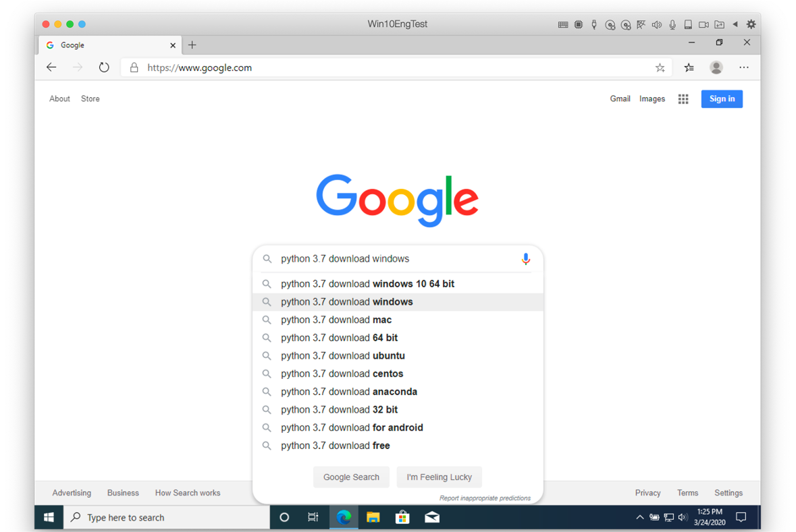
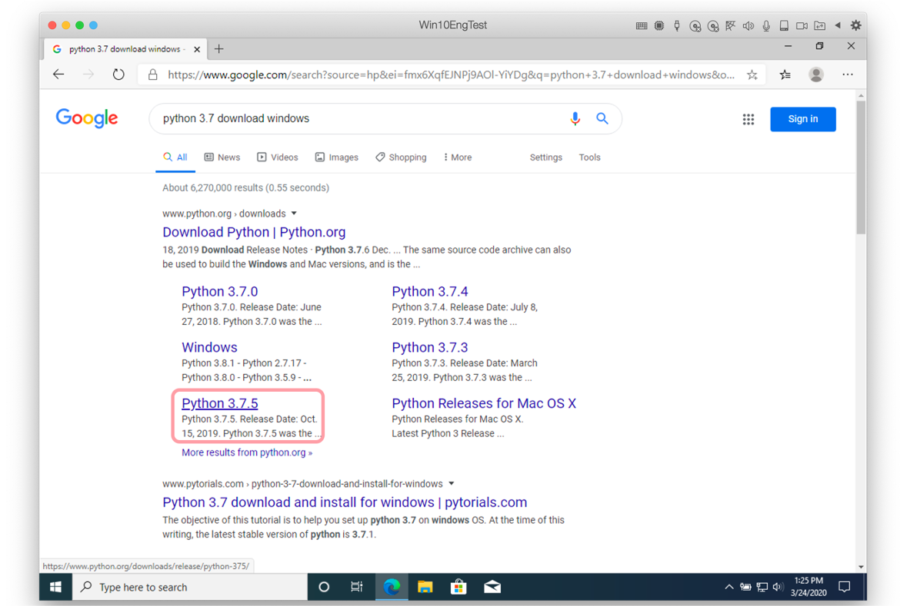
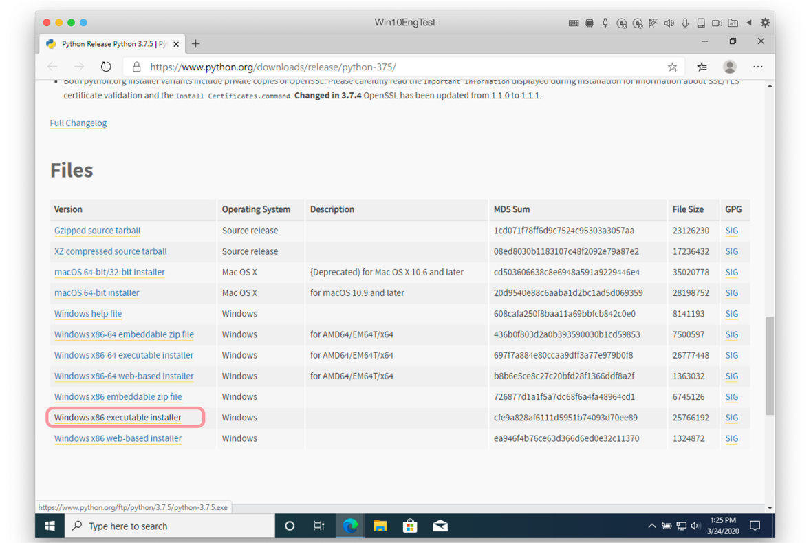
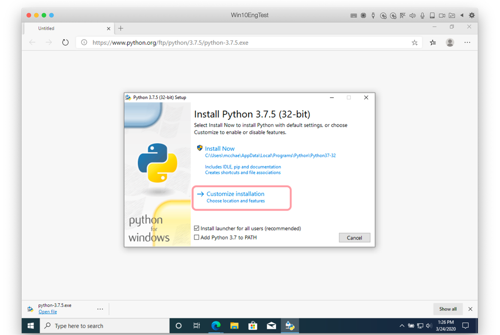
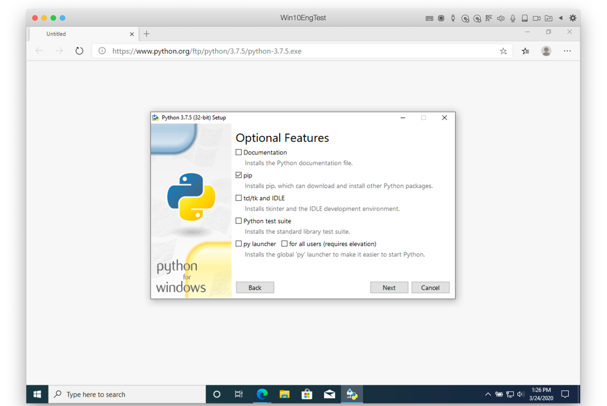
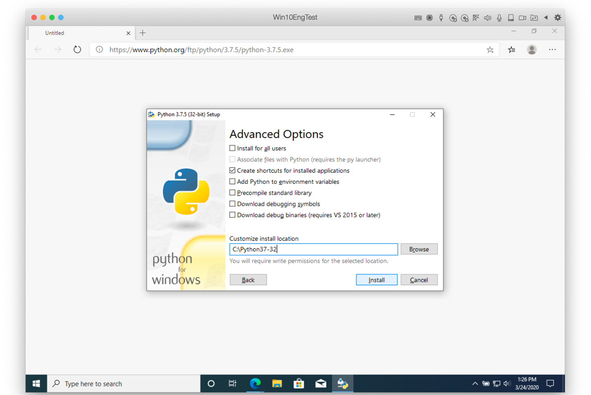
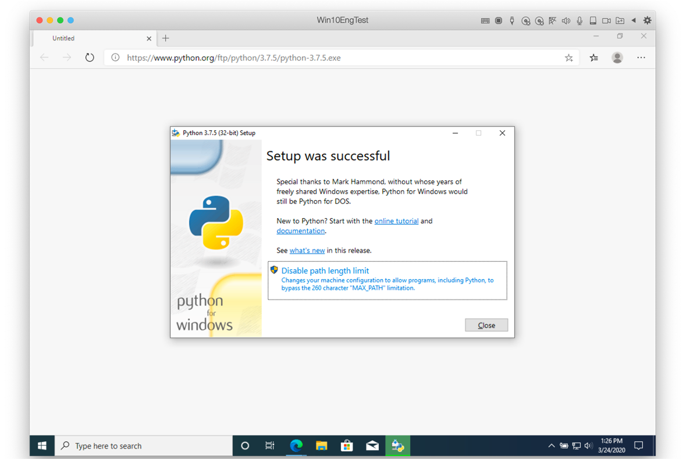

# Preparation of Python Interpreter

`ARGOS LABS` `plugin` is written in python, so need to [python](https://www.python.org/) interpreter.

Plugin can be developed in Windows, Linux or Mac. 
Our `STU` and `PAM` contains python interpreter which version is `3.7`. 

So we recommend to build our plugin with python `3.7`
> Generally speaking it's ok to use python 3.6 or later version

## Prepare Python 3.7 on Windows 10

### Installation

Firstly search `python 3.7 download windows` at google.


You can select python 3.7.x at [python.org](https://www.python.org/)

> Any miner version like 3.7.3, 3.7.5 or 3.7.9 is fine



Download `Windows x86 executable installer`

> * There are two kinds of installer, one is 32bit interpreter `x86` and the other is 64bit interpreter `x86-64`.
> * Our `STU` and `PAM` contains `32bit` python interpreter because this works well both 32bit or 64bit Windows 10 operation system.



Execute downloaded installer executable file and select `Customise installation`

> You can select `Install Now` with default configuration. However default installation path is not  easy to access by long pathname.



For optional features usually check [pip](https://packaging.python.org/key_projects/#pip) only.

> * Our `STU` and `PAM` contains default python interpreter with `pip` enabled.



You can change `Customize install location` with `C:\Python37-32` for `Advanced Options` . 

> This is because for the convinience of command at `CMD.EXE`



Finally it's successful to install python 3.7 32bit interpreter.

> No need to select `Disable path length limit` if you set `C:\Python37-32` for `Advanced Options`.



### How to build Virtual Environment on Windows

[virtualenv](https://virtualenv.pypa.io/en/latest/) is a tool to create isolated Python environments. This `Isolated Python environments` is one of core features of our `PAM`'s plugin running.

Let's suppose that you have installed python 3.7.x at `C:\Python37-32`.

Firstly open `CMD.EXE` terminal.

```sh
C:\> mkdir C:\work
C:\> cd \work
C:\work> C:\python37-32\python.exe -m venv py37
C:\work> dir py37
 Volume in drive C has no label.
 Volume Serial Number is E26A-C202

 Directory of C:\work\py37

07/13/2021  03:11 PM    <DIR>          .
07/13/2021  03:11 PM    <DIR>          ..
07/13/2021  03:11 PM    <DIR>          Include
07/13/2021  03:11 PM    <DIR>          Lib
07/13/2021  03:11 PM                78 pyvenv.cfg
07/13/2021  03:11 PM    <DIR>          Scripts
```
> * You can change `C:\work` working folder as you want.
> * You can change the name of `virtuenenv`, `py37` as you want.

#### Activate virtualenv

You need to activate `virtuenenv` in order to use the environment.

```sh
C:\> C:\work\py37\Scripts\Activate
(py37) C:\>
(py37) C:\> where python
C:\work\py37\Scripts\python.exe
(py37) C:\>python -V
Python 3.7.5
```

> * `(py37)` will be added at the front of `C:\>` prompt.
> * `where python` command shows where we can find `python.exe` executable file. This must be found at `C:\work\py37\Scripts\python.exe` at first line of results.
> * `python -V` shows the version of installed python interpreter.

#### Deactivate virtualenv

Once you activated then virtual environment you can use it. And after using it you have to deactivate it.

```sh
(py37) C:\>deactivate
C:\>
```
> * `(py37)` prefix will be disappeared at prompt and got back to `C:\>`.


## Prepare Python 3.7 on Linux (Ubuntu 18.04 Desktop)

`Python 3.x interpreter` may exist on most linux system. Because `STU` and `PAM` contains python `3.7` interpreter we need python version `3.7`.

There are many ways to install python 3.x on Linux however we recommend [pyenv](https://github.com/pyenv/pyenv).

> * There are so many linux distributions. We recommand [Ubuntu 20.04 Desktop](https://ubuntu.com/download/desktop)

All commands are run at `terminal`.

### Update and Install Dependencies
It’s always a good idea to start off any installation process by updating system packages:

```sh
toor@ubuntu:~$ sudo apt update -y
```

> * User name is `toor`

Once that has finished up, run the following command to install all of pyenv’s dependencies:

```sh
toor@ubuntu:~$ sudo apt install -y make build-essential libssl-dev zlib1g-dev \
libbz2-dev libreadline-dev libsqlite3-dev wget curl llvm libncurses5-dev \
libncursesw5-dev xz-utils tk-dev libffi-dev liblzma-dev python-openssl git
```

### Clone the Repository
To install the latest version of pyenv and provide a straightforward method for updating it, run the following command to pull it down from GitHub:

```sh
toor@ubuntu:~$ curl -L \
https://raw.githubusercontent.com/pyenv/pyenv-installer/master/bin/pyenv-installer \
| bash
```

### Configure the Environment
Next, to properly configure pyenv for use on the system, run the following block of commands to set some important environment variables and setup pyenv autocompletion:

```sh
echo 'export PYENV_ROOT="$HOME/.pyenv"' >> ~/.bashrc
echo 'export PATH="$PYENV_ROOT/bin:$PATH"' >> ~/.bashrc
echo -e 'if command -v pyenv 1>/dev/null 2>&1; then\n eval "$(pyenv init -)"\n eval "$(pyenv virtualenv-init -)"\nfi' >> ~/.bashrc
```

Finally, to start using pyenv, restart the shell by running:

```sh
toor@ubuntu:~$ exec "$SHELL"
```

### Verify the Installation
To verify that pyenv is installed correctly, we will try installing a new version of Python. First, we will list the available versions of Python:

```sh
toor@ubuntu:~$ pyenv install --list
```

The list of the available version is long. Let’s go ahead and install Python version 3.7.5:

```sh
toor@ubuntu:~$ pyenv install 3.7.5
Downloading Python-3.7.5.tar.xz...
-> https://www.python.org/ftp/python/3.7.5/Python-3.7.5.tar.xz
Installing Python-3.7.5...
Installed Python-3.7.5 to /home/toor/.pyenv/versions/3.7.5
```
Do not be surprised if it takes a while for this command to run. Pyenv is building this version of Python from source.

To verify that Python 3.7.5 is now installed run the pyenv versions command:

```sh
toor@ubuntu:~$ pyenv versions
* system (set by /home/toor/.pyenv/version)
  3.7.5
```
Now for further verification, change the version of Python to 3.7.5 and drop into a python shell.

```sh
toor@ubuntu:~$ pyenv global 3.7.5
toor@ubuntu:~$ pyenv versions
  system
* 3.7.5 (set by /home/toor/.pyenv/version)
```
Switching back is just as easy!
There you have it! With pyenv installed, you’re off and running with more granular control of your Python environment!

### Making virtual environment

```sh
toor@ubuntu:~$ pyenv virtualenv 3.7.5 py37
Looking in links: /tmp/tmpq23vjwu0
Requirement already satisfied: setuptools in /home/toor/.pyenv/versions/3.7.5/envs/py37/lib/python3.7/site-packages (41.2.0)
Requirement already satisfied: pip in /home/toor/.pyenv/versions/3.7.5/envs/py37/lib/python3.7/site-packages (19.2.3)
```
You can make `py37` virtuenenv.

### Activate virtualenv

You need to activate `py37` in order to use the environment.

```sh
toor@ubuntu:~$ pyenv activate py37
pyenv-virtualenv: prompt changing will be removed from future release. configure `export PYENV_VIRTUALENV_DISABLE_PROMPT=1' to simulate the behavior.
(py37) toor@ubuntu:~$
```
> * `(py37)` will be added at the front of `toor@ubuntu:~$` prompt.

### Deactivate virtualenv

You need to deactivate `py37` in order to exit the environment.

```sh
(py37) toor@ubuntu:~$ pyenv deactivate
toor@ubuntu:~$
```

## Prepare Python 3.7 on macOS (Big Sur)

`Python 3.x interpreter` may exist on most mac system. Howevery you need to install python version `3.7` because `STU` and `PAM` contains python `3.7`.

There are many ways to install python 3.x on macOS however we recommend [pyenv](https://github.com/pyenv/pyenv).

> * There are many macOS versions. We tested at [Big Sur](https://en.wikipedia.org/wiki/MacOS_Big_Sur).

All commands are run at `terminal`.

> * `zsh` is the default shell from `Catalyna` to `Big Sur` of macOS. So we explain with zsh terminal environment.

### Prerequsite environment

To install pyenv you need to install xcode comman line tools including compiler.

```sh
toor@mac: ~|⇒ xcode-select --install
```

If above command result next error and want to reinstall SDK:

```sh
toor@mac: ~|⇒ xcode-select --install
xcode-select: error: command line tools are already installed, use "Software Update" to install updates

toor@mac: ~|⇒ sudo rm -rf /Library/Developer/CommandLineTools
toor@mac: ~|⇒ xcode-select --install
```

And add `SDKROOT` to environmental variable.

```sh
echo 'export SDKROOT="/Applications/Xcode.app/Contents/Developer/Platforms/MacOSX.platform/Developer/SDKs/MacOSX.sdk"' >> ~/.zshrc
```

> * If your mac has M1 chip instead Intel chip please read the blog, [How to Run Homebrew & x86 Terminal Apps on M1 Macs](https://osxdaily.com/2020/11/18/how-run-homebrew-x86-terminal-apple-silicon-mac/) and then open terminal using Rosetta.
> * Please use x86 termial for all terminal commands.

### Install homebrew

[homebrew](https://brew.sh/index) is the missing package manager for macOS to install open-source packages.

```sh
toor@mac: ~|⇒ /bin/bash -c "$(curl -fsSL https://raw.githubusercontent.com/Homebrew/install/HEAD/install.sh)"
```

Now you can run `brew` command at your terminal.

To begin with update brew package:

```sh
toor@mac: ~|⇒ brew update
```

> * It takes some time at first time to build all homebrew packages.

### Install pyenv

You can install pyenv with `brew` command.

```sh
toor@mac: ~|⇒ brew install pyenv pyenv-virtualenv
toor@mac: ~|⇒ pyenv
pyenv 2.0.3
Usage: pyenv <command> [<args>]

Some useful pyenv commands are:
   --version   Display the version of pyenv
   activate    Activate virtual environment
   commands    List all available pyenv commands
   deactivate   Deactivate virtual environment
   exec        Run an executable with the selected Python version
   global      Set or show the global Python version(s)
   help        Display help for a command
   hooks       List hook scripts for a given pyenv command
   init        Configure the shell environment for pyenv
   install     Install a Python version using python-build
   local       Set or show the local application-specific Python version(s)
   prefix      Display prefix for a Python version
   rehash      Rehash pyenv shims (run this after installing executables)
   root        Display the root directory where versions and shims are kept
   shell       Set or show the shell-specific Python version
   shims       List existing pyenv shims
   uninstall   Uninstall a specific Python version
   version     Show the current Python version(s) and its origin
   version-file   Detect the file that sets the current pyenv version
   version-name   Show the current Python version
   version-origin   Explain how the current Python version is set
   versions    List all Python versions available to pyenv
   virtualenv   Create a Python virtualenv using the pyenv-virtualenv plugin
   virtualenv-delete   Uninstall a specific Python virtualenv
   virtualenv-init   Configure the shell environment for pyenv-virtualenv
   virtualenv-prefix   Display real_prefix for a Python virtualenv version
   virtualenvs   List all Python virtualenvs found in `$PYENV_ROOT/versions/*'.
   whence      List all Python versions that contain the given executable
   which       Display the full path to an executable
```

### Verify the Installation
To verify that pyenv is installed correctly, we will try installing a new version of Python. First, we will list the available versions of Python:

```sh
toor@mac: ~|⇒ pyenv install --list
```

The list of the available version is long. Let’s go ahead and install Python version 3.7.5:

```sh
toor@mac: ~|⇒ pyenv install 3.7.11
python-build: use openssl@1.1 from homebrew
python-build: use readline from homebrew
Downloading Python-3.7.11.tar.xz...
-> https://www.python.org/ftp/python/3.7.11/Python-3.7.11.tar.xz
Installing Python-3.7.11...
python-build: use readline from homebrew
python-build: use zlib from xcode sdk
Installed Python-3.7.11 to /Users/mcchae/.pyenv/versions/3.7.11
```
Do not be surprised if it takes a while for this command to run. Pyenv is building this version of Python from source.

To verify that Python 3.7.11 is now installed run the pyenv versions command:

```sh
toor@mac: ~|⇒ pyenv versions
* system (set by /Users/toor/.pyenv/version)
  3.7.11
```
Now for further verification, change the version of Python to 3.7.11 and drop into a python shell.

```sh
toor@mac: ~|⇒ pyenv global 3.7.11
toor@mac: ~|⇒ pyenv versions
  system
* 3.7.11 (set by /Users/toor/.pyenv/version)
```
Switching back is just as easy!
There you have it! With pyenv installed, you’re off and running with more granular control of your Python environment!

### Making virtual environment

```sh
toor@mac: ~|⇒ pyenv virtualenv 3.7.11 py37
Looking in links: /var/folders/ww/15mp7fm94wl2h_05pqq3w74m0000gn/T/tmpyry_b255
Requirement already satisfied: setuptools in /Users/mcchae/.pyenv/versions/3.7.11/envs/py37/lib/python3.7/site-packages (47.1.0)
Requirement already satisfied: pip in /Users/mcchae/.pyenv/versions/3.7.11/envs/py37/lib/python3.7/site-packages (20.1.1)
```
You can make `py37` virtuenenv.

### Activate virtualenv

You need to activate `py37` in order to use the environment.

```sh
toor@mac: ~|⇒ pyenv activate py37
pyenv-virtualenv: prompt changing will be removed from future release. configure `export PYENV_VIRTUALENV_DISABLE_PROMPT=1' to simulate the behavior.
(py37) toor@mac: ~|⇒
```
> * `(py37)` will be added at the front of `toor@mac: ~|⇒` prompt.
> * Some recent pyenv activation does not have `(py37)` prefix at prompt.

You can verify which virtualenv is activated.

```sh
toor@mac: ~|⇒ pyenv versions
  system
  3.7.11
  3.7.11/envs/py37
* py37 (set by PYENV_VERSION environment variable)
```

### Deactivate virtualenv

You need to deactivate `py37` in order to exit the environment.

```sh
(py37) toor@mac: ~|⇒ pyenv deactivate
toor@mac: ~|⇒
```
