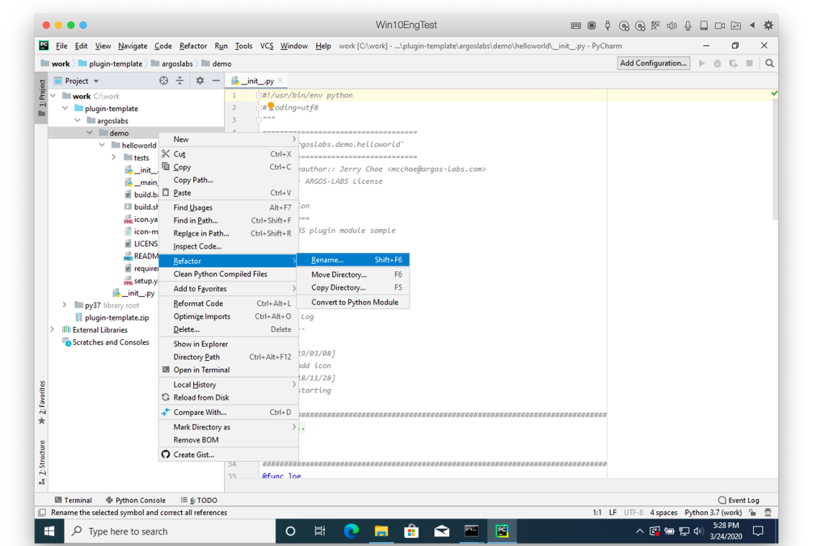
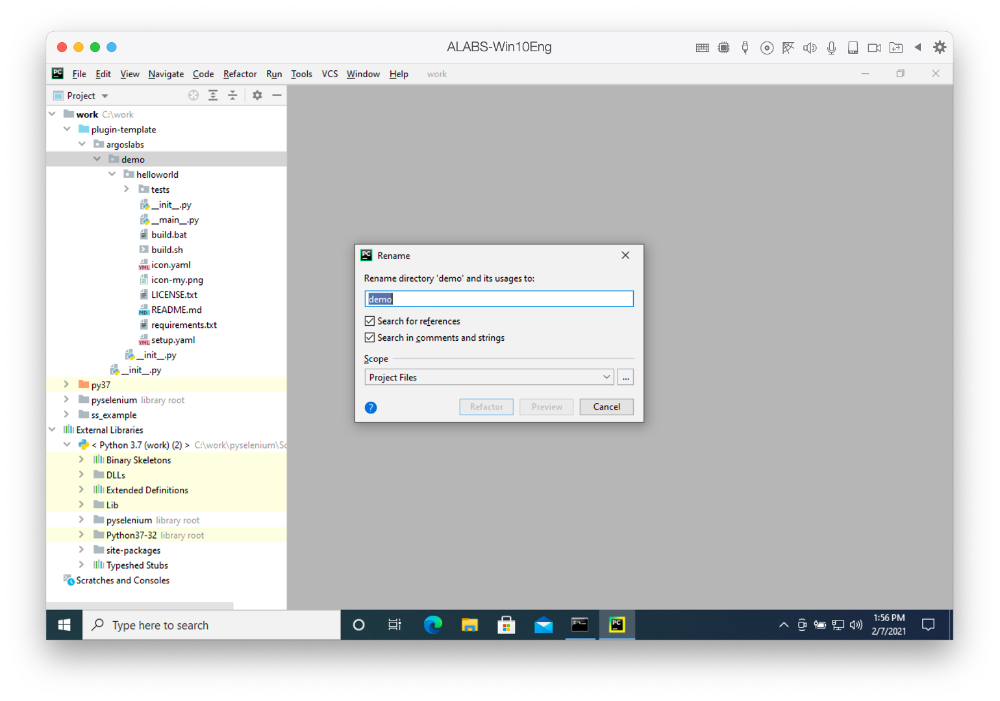
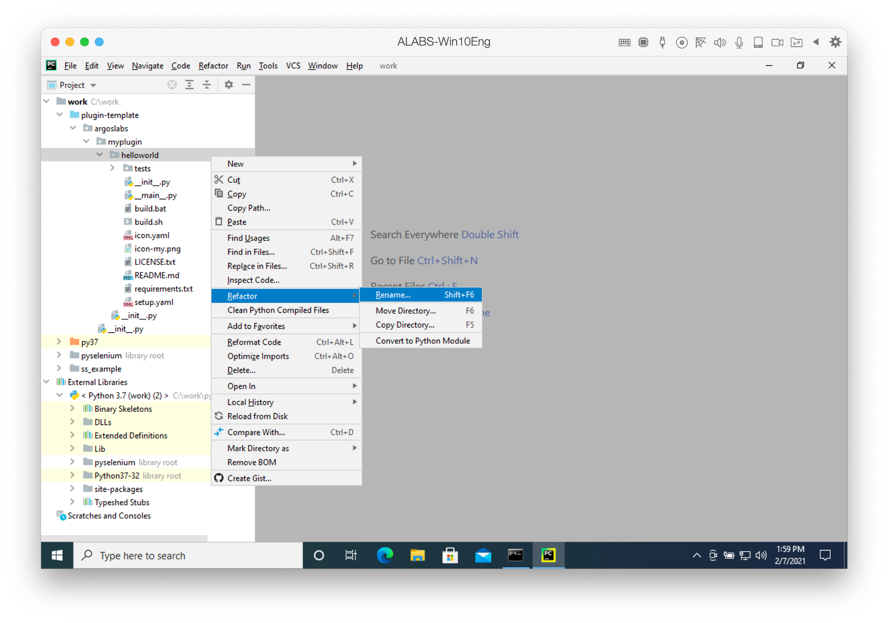
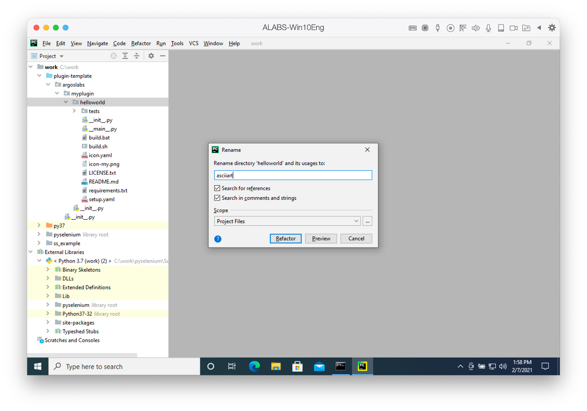
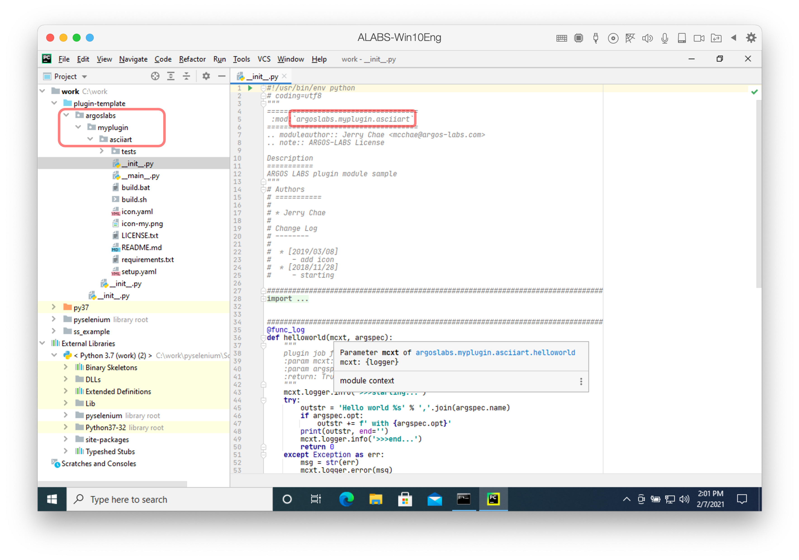

# Set package name

Python package is consists with a folder with `__init__.py` file in it.

ARGOS Low-Code plugin has the following naming rule:
* Package name looks like `argoslabs.group.name`
* Starting `argoslabs` cannot be changed.
* You can set the group name, `group` as you wish. However this must be meaningful to everyone.
* The `name` is the name of plugin. The more specific name is better.

> * `group` and `name` are only allowed lowercase alphabet and underbar character which can be expressed by Regular Expression,  `[a-z_]`
> Our template has the package name of `argoslabs.demo.helloworld`
> Under `plugin-template` folder next folder structure may be seen:

```sh
plugin-template
+-- argoslabs
   +-- __init__.py
   +-- demo
      +-- __init__.py
      +-- helloworld
         +-- __init__.py
         +-- ...
```



Firstly you can rename the `demo` group name with your own.
You can do as follows:
> * Click the `demo` folder
> * Click the right button
> * Select `Refactor > Rename` or press `Shift + F6`



You enter `myplugin` as example. 
> You can set proper group name as you wish like company name.



Now it's time to rename `helloworld` plugin name.



Let's change into `asciiart`.



You can see `argoslabs/myplugin/asciiart` folder structure at Project pane.

> Instead of changing folder name, why use `refactor > rename` functionality is that all reference including comments are automatically changed.

Whenever you build a new plugin you can use this template.