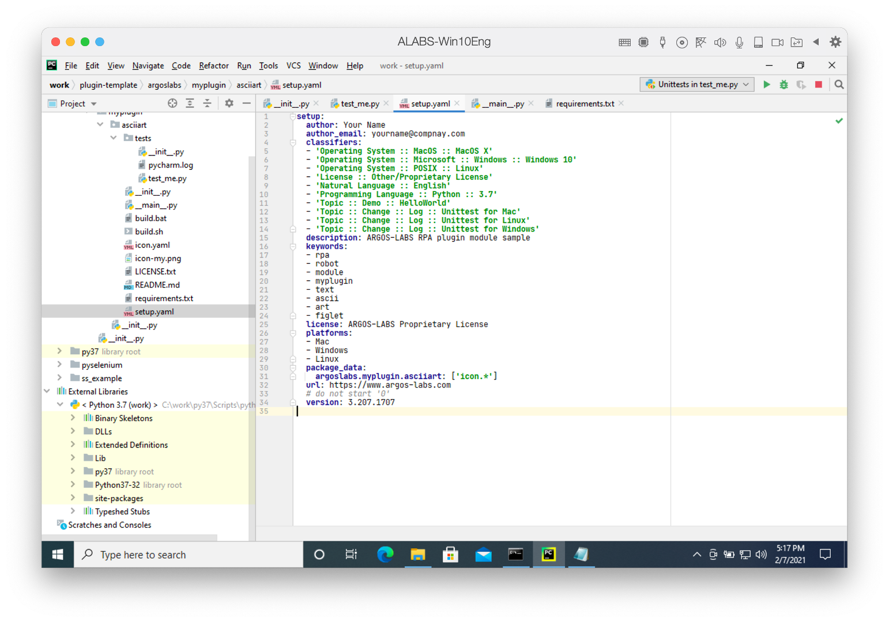

# Tags and Version



You can find `setup.yaml` file at `asciiart` folder in which main code `__init__.py` exists.

This YAML file looks like:

```yaml
setup:
  author: Your Name
  author_email: yourname@your-company
  classifiers:
  - 'Operating System :: MacOS :: MacOS X'
  - 'Operating System :: Microsoft :: Windows :: Windows 10'
  - 'Operating System :: POSIX :: Linux'
  - 'License :: Other/Proprietary License'
  - 'Natural Language :: English'
  - 'Programming Language :: Python :: 3.7'
  - 'Topic :: Text :: AsciiArt'
  description: ARGOS-LABS RPA plugin module for ASCII art
  keywords:
  - ascii
  - art
  - text
  - figlet
  license: ARGOS-LABS Proprietary License
  platforms:
  - Mac
  - Windows
  - Linux
  package_data:
    argoslabs.myplugin.asciiart: ['icon.*', 'README*.*']
  url: https://www.argos-labs.com
  version: 3.202.3300
```

This yaml is almost silimar with the [setup.py](https://docs.python.org/3.7/distutils/setupscript.html).
Each iterms explained as follows:

* `author` - Name of the plugin builder
* `author_email` - email for the plugin builder
* `classifiers` - python modules [classifiers](https://peps.python.org/pep-0301/#distutils-trove-classification)
* `description` - description for this plugin
* `keywords` - Tags or keywords for this plugin. ***This tags are used for searching at operation at `STU`.***
* `license` - License of this plugin
* `platforms` - Supporting OS platforms
* `package_data`
  * Please make sure the package name is the plugin's package name, in this example `argoslabs.myplugin.asciiart`
  * Next list is the additional files which included at `wheel` module file. You have to add `icon.png` file for the icon of `STU` operation, and `README*.*` files for help contents
* `version` - plugin's version

> **Note** - There are three parts in the template for Python package name to change `argoslabs.demo.helloworld` to your's `argoslabs.myplugin.asciiart` in this example.
> * At the file `plugin-template\argoslabs\myplugin\asciiart\setup.yaml`:
>   > `argoslabs.demo.helloworld: ['icon.*', 'README*.*']`
>   > Change from above line to next line
>   > `argoslabs.myplugin.asciiart: ['icon.*', 'README*.*']`
> * At the file `plugin-template\argoslabs\myplugin\asciiart\main.py`:
>   > `from argoslabs.demo.helloworld import main`
>   > Change from above line to next line
>   > `from argoslabs.myplugin.asciiart import main`
> * At the file `plugin-template\argoslabs\myplugin\asciiart\tests\test_me.py`:
>   > `from argoslabs.demo.helloworld import _main as main`
>   > Change from above line to next line
>   > `from argoslabs.myplugin.asciiart import _main as main`
> 
> *Sometimes import statements can be changed automatically by refectoring functionality at main.py or test_me.py but sometimes not. So before building all be sure to checking above three references.*

